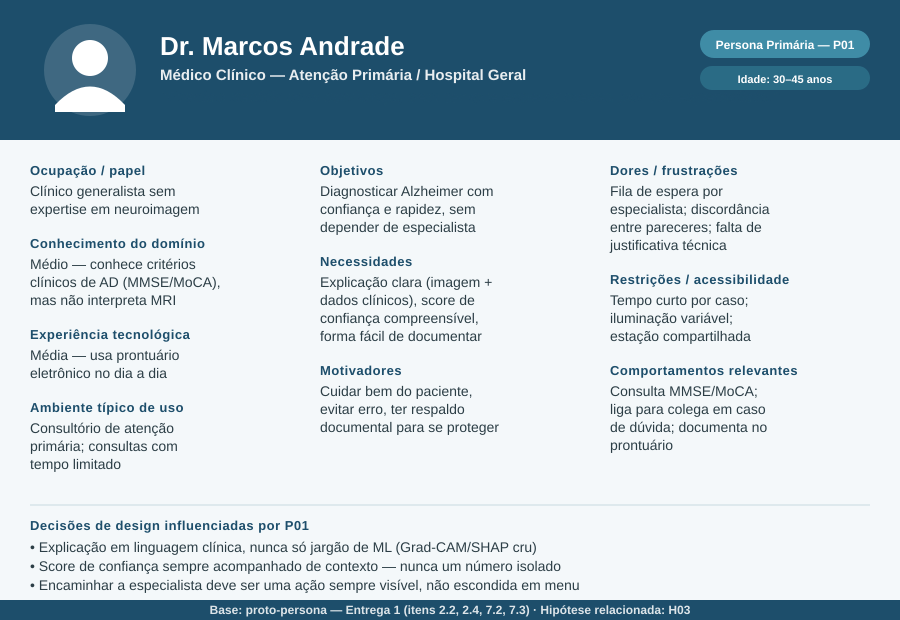
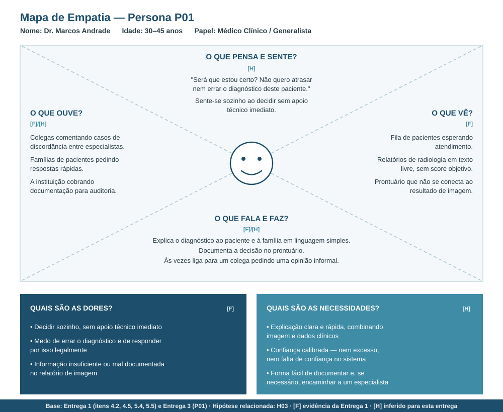

# Entrega 3 — Personas, mapa de empatia, contexto de uso e jornada

- **Data:** 09/09/2026
- **Status:** 🟨 em andamento
- **Responsabilidade:** 1 persona por integrante; 1 mapa de empatia, 1 contexto de uso consolidado e 1 jornada por equipe.

## Objetivo da atividade

Representar grupos de usuários de forma útil para decisões de design. Persona não é personagem decorativo: suas características devem alterar requisitos, prioridades, linguagem, fluxos ou critérios de avaliação.

## Atenção a projetos técnicos

Em TCCs sem interface original, a persona pode representar um **profissional que se apropria da contribuição técnica**: DBA, analista, cientista de dados, administrador, pesquisador, técnico, operador, gestor ou especialista de domínio.

Não escolha um perfil apenas porque “parece combinar” com a tecnologia. Explique **qual objetivo esse perfil teria e qual parte da contribuição do TCC produziria valor para ele**. Se ainda for hipótese, mantenha como hipótese/proto-persona a validar.

Também considere papéis diferentes quando houver tarefas distintas, por exemplo:

- operador que executa análises;
- administrador que configura e gerencia permissões;
- especialista que interpreta resultados;
- gestor que consulta relatórios e decide;
- auditor que revisa histórico.

## Entradas da Entrega 1

Antes de criar personas, retome os tipos de usuários, características relevantes, objetivos e hipóteses registradas na Entrega 1. A persona **não deve transformar uma hipótese inicial em fato por meio de uma história fictícia**.

| Item da Entrega 1 | Status inicial | Evidência disponível agora | Como será tratado nesta entrega |
|---|---|---|---|
| Médico Clínico como perfil priorizado (item 7.2) | [F] | Entrega 1, itens 2.2, 2.4, 7.2 | incorporar como P01 (persona primária) |
| Objetivo priorizado: diagnosticar com confiança e rapidez (item 7.3) | [F] | Entrega 1, item 7.3 | incorporar como objetivo central de P01 e da jornada |
| H03 — médico entende score de confiança sem treinamento extenso | [H] aberta | Rastreabilidade; reforçada indiretamente pelo estudo Al-bakri et al. 2025 (Entrega 2, C02) — 80% dos médicos relataram confiança apenas "condicional" | mantida como hipótese; incorporada como dor/necessidade de P01, não tratada como fato |
| Neurologista, Radiologista, Técnico de Laboratório, Pesquisador (item 2.2) | [F] | Entrega 1, item 2.2 | manter como personas secundárias (P02, P03, P04) — a preencher pelos demais integrantes |
| Caso Maria Silva (item 4.5) | [F] (narrativa ilustrativa) | Entrega 1, item 4.5 | usada como evidência da dor "discordância entre pareceres", não convertida em fato genérico |
| Contexto de uso (item 5.1–5.6) | [F]/[H] | Entrega 1, seção 5 | incorporado na consolidação da seção 3 abaixo |

## 1. Personas

### Persona P01 — Dr. Marcos Andrade

- **Autor(a):** Paulo Hudson — 22.222.013-9
- **Tipo:** primária
- **Base de evidências:** combinação de Entrega 1 (itens 2.2, 2.4, 4.5, 5.x, 7.2, 7.3) com literatura citada na Entrega 2 (Al-bakri et al., 2025)
- **Hipóteses da Entrega 1 relacionadas:** H03 (confiança sem treinamento extenso)

| Campo | Descrição |
|---|---|
| Faixa etária / contexto relevante | 30–45 anos; clínico em início/meio de carreira, ainda sem grande volume de casos complexos de AD |
| Ocupação/papel | Médico clínico / generalista, atuando em atenção primária ou hospital geral |
| Conhecimento do domínio | Médio — conhece critérios clínicos de Alzheimer (MMSE, MoCA, história clínica), mas não tem formação para interpretar MRI tecnicamente |
| Experiência tecnológica | Média — usa prontuário eletrônico e sistemas clínicos padrão no dia a dia; não é usuário avançado de ferramentas técnicas |
| Objetivos | Diagnosticar Alzheimer com confiança e rapidez, sem depender de um especialista que pode levar meses para atender |
| Necessidades | Explicação clara combinando imagem e dados clínicos; score de confiança compreensível; forma simples de documentar a decisão; caminho fácil para encaminhar a um especialista quando necessário |
| Dores/frustrações | Fila de espera longa por especialista; discordância entre pareceres (radiologista vs. neurologista); falta de justificativa técnica no relatório de imagem; medo de errar o diagnóstico |
| Motivadores | Cuidar bem do paciente; evitar erro que prejudique alguém (como no caso Maria Silva); ter respaldo documental em caso de questionamento |
| Restrições/acessibilidade | Tempo curto por consulta; iluminação de consultório nem sempre ideal; possível uso de estação de trabalho compartilhada |
| Ambiente típico de uso | Consultório de atenção primária ou hospital geral; computador desktop padrão, integrado ao prontuário eletrônico |
| Comportamentos relevantes | Consulta MMSE/MoCA como parte da rotina; liga para colega quando tem dúvida; documenta a decisão no prontuário; pode encaminhar a um especialista em casos incertos |

**Decisões de design influenciadas por P01:**

- Explicação deve ser traduzida para linguagem clínica — nunca expor apenas termos técnicos de ML (Grad-CAM, SHAP) sem contexto.
- O score de confiança nunca deve aparecer isolado — precisa vir acompanhado de explicação textual/visual, já que a literatura (Al-bakri et al., 2025) mostra confiança "condicional" mesmo com explicação combinada.
- A ação de encaminhar a um especialista deve estar sempre visível na interface, não escondida em um submenu — é a válvula de escape para os casos em que H03 se confirmar (médico não entende o suficiente para decidir sozinho).
- O fluxo de documentação da decisão deve aproveitar o que já foi mostrado na explicação (não pedir que o médico redigite tudo do zero), para não virar um obstáculo que ele acaba pulando.

### Persona P02 — Dr. César Andrade de Melo

- **Autor(a):** Ana Carolina Lazzuri
- **Tipo:** secundária
- **Base de evidências:** Entrega 1 (itens 2.2, 2.4, 4.5, 5.x) e análise de concorrência da Entrega 2 (OHIF Viewer e BrainSee)
- **Hipóteses da Entrega 1 relacionadas:** H03 (validação de casos complexos ou divergentes com explicação aprofundada)

| Campo | Descrição |
|---|---|
| **Faixa etária / contexto** | 45–60 anos; neurologista especialista em demências. |
| **Ocupação/papel** | Neurologista em centro de referência ou hospital universitário. |
| **Conhecimento do domínio** | Alto — domínio total de neuroimagem (MRI) e testes cognitivos. |
| **Experiência tecnológica** | Média-Alta — usa PACS e visualizadores DICOM; cético a IAs "caixa-preta". |
| **Objetivos** | Confirmar a suspeita em casos difíceis e resolver dúvidas entre médicos. |
| **Necessidades** | Visualizar destaques anatômicos (Grad-CAM), pesos dos dados (SHAP) e exportar laudo. |
| **Dores/frustrações** | Receber diagnósticos prévios inconsistentes e ter que reavaliar a MRI do zero. |
| **Motivadores** | Garantir a precisão diagnóstica precoce e ter respaldo técnico para a decisão. |
| **Restrições/acessibilidade** | Alta carga de casos por turno; necessita de navegação ágil por atalhos. |
| **Ambiente típico de uso** | Consultório especializado; desktop com tela de alta resolução integrada ao PACS. |
| **Comportamentos** | Analisa cortes da MRI, cruza com testes cognitivos e emite o parecer final. |

**Decisões de design influenciadas por P02:**

- **Controle de transparência no heatmap:** Permitir ajustar a opacidade do Grad-CAM (0% a 100%) para inspecionar o cérebro original.
- **Exibição multimodal detalhada:** Exibir gráficos explicativos dos atributos clínicos (SHAP) além do score de risco.
- **Navegação rápida por cortes:** Manter o scroll do mouse e ajustes de contraste padrão do fluxo de radiologia.
- **Laudo de auditoria:** Permitir a geração de relatório em PDF com as explicações da IA para anexar ao prontuário.

### Persona P03 — Regina Albuquerque Marins

- **Autor(a):** Raphael Garavati Erbert
- **Tipo:** secundária (stakeholder, não usuária direta da tela de diagnóstico)
- **Base de evidências:** Entrega 1 (item 2.3 — caracterização como stakeholder realocado; item 9.1 — benefício "reduzir divergência de interpretação" tem impacto institucional)
- **Hipóteses da Entrega 1 relacionadas:** **H04** — Gestores aprovariam a adoção se houver ganho comprovado

**Justificativa do perfil:** diferente de P01 e P02, Regina não interage com a tela de análise de caso (Grad-CAM/SHAP/upload), ela consome relatórios agregados para decidir se o M-XAI Net continua sendo usado no hospital, se é expandido para outras unidades, ou se é descontinuado. Ela é quem transforma o mérito técnico do TCC (item 1.5 — validação clínica, padronização, redução de custo com diagnóstico especializado) em decisão de adoção real. Sem esse perfil, o TCC entrega um modelo tecnicamente válido que nunca sai do papel — H04 é justamente a hipótese que testa se esse "último passo" institucional se sustenta.

| Campo | Descrição |
|---|---|
| Faixa etária / contexto relevante | 45–58 anos; gestora com formação médica ou em administração hospitalar, atuando há anos em cargo de gestão |
| Ocupação/papel | Diretora clínica ou gestora hospitalar responsável por decisões de adoção de novas ferramentas/tecnologias no serviço |
| Conhecimento do domínio | Alto sobre gestão clínica, indicadores de qualidade e processos hospitalares; médio-baixo sobre detalhes técnicos de IA/XAI — precisa que o ganho seja traduzido em métricas de gestão (tempo, custo, risco), não em termos de ML |
| Experiência tecnológica | Média — usa dashboards de BI e sistemas de gestão hospitalar; não opera a ferramenta clínica diretamente |
| Objetivos | Decidir, com base em evidência agregada, se a ferramenta deve ser adotada, expandida ou descontinuada no serviço |
| Necessidades | Relatório agregado (não caso a caso) com indicadores objetivos: tempo médio de diagnóstico antes/depois, taxa de concordância entre médicos, volume de casos processados, incidentes/erros registrados |
| Dores/frustrações | Falta de evidência quantitativa para justificar investimento perante a diretoria; risco de adotar ferramenta que gere passivo legal (item 5.6 — falso negativo/positivo); dificuldade de comparar ganho real vs. custo de implementação |
| Motivadores | Reduzir fila de espera e custo com diagnóstico especializado (item 1.4 — benefício para organizações); evitar risco legal associado a "caixa-preta" clínica; melhorar indicadores de qualidade do serviço |
| Restrições/acessibilidade | Pouco tempo dedicado a analisar ferramenta caso a caso; decisão tomada em reuniões periódicas de gestão, não no fluxo clínico do dia a dia |
| Ambiente típico de uso | Escritório administrativo do hospital (citado no item 5.1); acesso a dashboard de BI, não à tela de diagnóstico |
| Comportamentos relevantes | Revisa relatórios agregados periodicamente; compara indicadores antes/depois da adoção; discute com equipe clínica e compliance antes de decidir |

**Decisões de design influenciadas por P03:**

- É preciso existir uma camada de relatório agregado/institucional (dashboard com métricas de uso, não só o laudo por paciente) — algo que nenhuma tela pensada até agora (focada no médico clínico) cobre, e que fica fora do escopo de IHC da disciplina (item "Delimitação: fora do escopo — auditoria em nível de sistema"), mas deve ser registrado como necessidade real de P03 para eventual trabalho futuro.
- Os indicadores expostos a Regina devem ser de gestão (tempo, custo, concordância, incidentes), nunca métricas técnicas de ML (AUC, F1-score) — reforça a distinção de linguagem técnica por perfil já mapeada no item 2.4.
- A trilha de auditoria (item 5.5, já prevista para o médico) deve ser agregável em relatório de gestão, evitando duplicar esforço de registro — o log criado para rastreabilidade médica é a mesma fonte de dado que sustenta a decisão de adoção de P03.
- Reforça, por contraste, por que o **recorte de IHC da disciplina exclui esse perfil da interface principal** (item "Fora do escopo de IHC": auditoria em nível de sistema) — P03 existe para deixar isso explícito e justificado, não para virar tela nova.

> Repita para P02, P03... Cada integrante deve produzir ao menos uma persona.

### Síntese das personas

Explique diferenças entre os perfis e qual persona é prioritária. Evite personas duplicadas que só mudam nome/foto.

## 2. Mapa de empatia — equipe

**Persona escolhida:** {{P01}}  
**Justificativa:** {{por que esse perfil é relevante}}

Documente também em texto: o que vê; ouve; diz/faz; pensa/sente; dores; ganhos. Diferencie **evidência** de **hipótese**.

## 3. Contexto de uso — consolidação

| Dimensão | Descrição | Implicação de design |
|---|---|---|
| Usuários | {{...}} | {{...}} |
| Tarefas | {{...}} | {{...}} |
| Equipamentos | {{...}} | {{...}} |
| Ambiente físico | {{...}} | {{...}} |
| Ambiente social/organizacional | {{...}} | {{...}} |
| Papéis/permissões/governança | {{...}} | {{...}} |
| Volume de dados/histórico | {{...}} | {{...}} |

## 4. Jornada do usuário — equipe

**Persona:** {{P01}}  
**Objetivo da jornada:** {{...}}  
**Início e fim da jornada:** {{...}}

| Etapa | Situação/ação | Objetivo | Pensamento/emoção | Dor | Oportunidade de design | Evidência |
|---|---|---|---|---|---|---|
| 1 | {{...}} | {{...}} | {{...}} | {{...}} | {{...}} | {{...}} |

> A jornada pode incluir etapas **antes, durante e depois** do uso do produto. Não transforme a jornada em lista de telas.

## Síntese

Quais necessidades e objetivos devem obrigatoriamente aparecer nos cenários e nas tarefas seguintes?

## Checklist

- [ ] Existe pelo menos uma persona por integrante.
- [ ] As personas não são apenas diferenças demográficas superficiais.
- [ ] Está claro o que é dado real e o que é hipótese/proto-persona.
- [ ] A persona não “validou por ficção” uma hipótese da Entrega 1; afirmações continuam marcadas como hipótese quando não há evidência.
- [ ] Objetivos e dores têm consequência para o design.
- [ ] Contexto de uso está coerente com a Entrega 1.
- [ ] Em TCC sem interface original, a persona possui relação explícita com a contribuição técnica.
- [ ] Papéis administrativos, técnicos e decisórios só foram criados quando possuem objetivos/tarefas diferentes.
- [ ] Jornada possui etapas, dores e oportunidades e não é apenas wireflow.
- [ ] IDs das personas foram adicionados à rastreabilidade.
