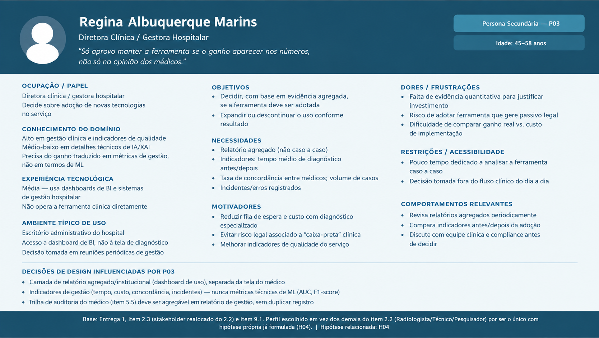
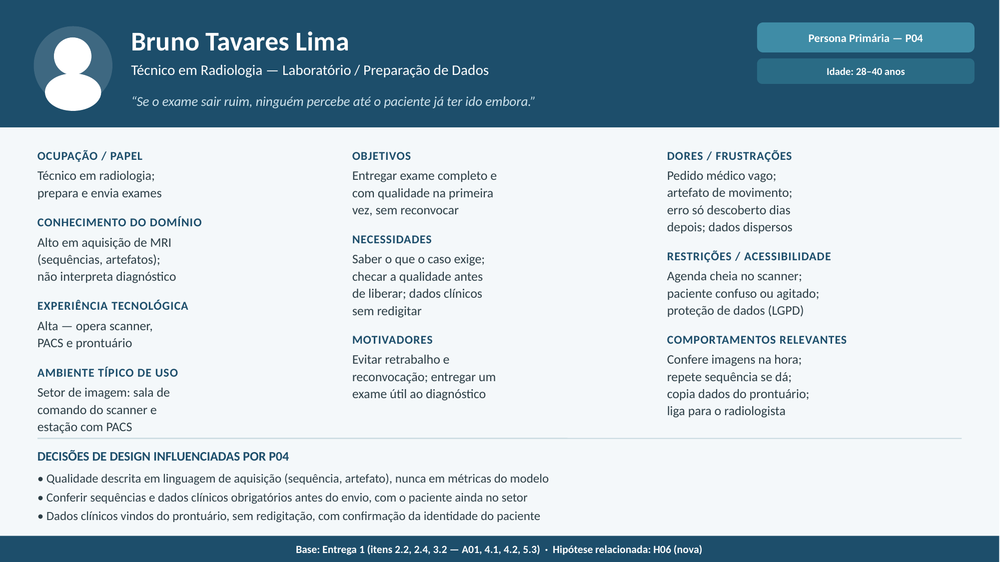

# Entrega 3 — Personas, mapa de empatia, contexto de uso e jornada

- **Data:** 09/09/2026
- **Status:** 🟩 Concluído
- **Responsabilidade:** 1 persona por integrante; 1 mapa de empatia, 1 contexto de uso consolidado e 1 jornada por equipe.

## Objetivo da atividade

Representar grupos de usuários de forma útil para decisões de design. Persona não é personagem decorativo: suas características devem alterar requisitos, prioridades, linguagem, fluxos ou critérios de avaliação.

## Atenção a projetos técnicos

Em TCCs sem interface original, a persona pode representar um **profissional que se apropria da contribuição técnica**: DBA, analista, cientista de dados, administrador, pesquisador, técnico, operador, gestor ou especialista de domínio.

Não escolha um perfil apenas porque “parece combinar” com a tecnologia. Explique **qual objetivo esse perfil teria e qual parte da contribuição do TCC produziria valor para ele**. Se ainda for hipótese, mantenha como hipótese/proto-persona a validar.

Também considere papéis diferentes quando houver tarefas distintas, por exemplo:

- operador que executa análises;
- administrador que configura e gerencia permissões;
- especialista que interpreta resultados;
- gestor que consulta relatórios e decide;
- auditor que revisa histórico.

## Entradas da Entrega 1

Antes de criar personas, retome os tipos de usuários, características relevantes, objetivos e hipóteses registradas na Entrega 1. A persona **não deve transformar uma hipótese inicial em fato por meio de uma história fictícia**.

| Item da Entrega 1 | Status inicial | Evidência disponível agora | Como será tratado nesta entrega |
|---|---|---|---|
| Médico Clínico como perfil priorizado (item 7.2) | [F] | Entrega 1, itens 2.2, 2.4, 7.2 | incorporar como P01 (persona primária) |
| Objetivo priorizado: diagnosticar com confiança e rapidez (item 7.3) | [F] | Entrega 1, item 7.3 | incorporar como objetivo central de P01 e da jornada |
| H03 — médico entende score de confiança sem treinamento extenso | [H] aberta | Rastreabilidade; reforçada indiretamente pelo estudo Al-bakri et al. 2025 (Entrega 2, C02) — 80% dos médicos relataram confiança apenas "condicional" | mantida como hipótese; incorporada como dor/necessidade de P01, não tratada como fato |
| Neurologista, Radiologista, Técnico de Laboratório, Pesquisador (item 2.2) | [F] | Entrega 1, item 2.2 | manter como personas secundárias (P02, P03, P04) — a preencher pelos demais integrantes |
| Caso Maria Silva (item 4.5) | [F] (narrativa ilustrativa) | Entrega 1, item 4.5 | usada como evidência da dor "discordância entre pareceres", não convertida em fato genérico |
| Contexto de uso (item 5.1–5.6) | [F]/[H] | Entrega 1, seção 5 | incorporado na consolidação da seção 3 abaixo |

## 1. Personas

### Persona P01 — Dr. Marcos Andrade

- **Autor(a):** Paulo Hudson — 22.222.013-9
- **Tipo:** primária
- **Base de evidências:** combinação de Entrega 1 (itens 2.2, 2.4, 4.5, 5.x, 7.2, 7.3) com literatura citada na Entrega 2 (Al-bakri et al., 2025)
- **Hipóteses da Entrega 1 relacionadas:** H03 (confiança sem treinamento extenso)

| Campo | Descrição |
|---|---|
| Faixa etária / contexto relevante | 30–45 anos; clínico em início/meio de carreira, ainda sem grande volume de casos complexos de AD |
| Ocupação/papel | Médico clínico / generalista, atuando em atenção primária ou hospital geral |
| Conhecimento do domínio | Médio — conhece critérios clínicos de Alzheimer (MMSE, MoCA, história clínica), mas não tem formação para interpretar MRI tecnicamente |
| Experiência tecnológica | Média — usa prontuário eletrônico e sistemas clínicos padrão no dia a dia; não é usuário avançado de ferramentas técnicas |
| Objetivos | Diagnosticar Alzheimer com confiança e rapidez, sem depender de um especialista que pode levar meses para atender |
| Necessidades | Explicação clara combinando imagem e dados clínicos; score de confiança compreensível; forma simples de documentar a decisão; caminho fácil para encaminhar a um especialista quando necessário |
| Dores/frustrações | Fila de espera longa por especialista; discordância entre pareceres (radiologista vs. neurologista); falta de justificativa técnica no relatório de imagem; medo de errar o diagnóstico |
| Motivadores | Cuidar bem do paciente; evitar erro que prejudique alguém (como no caso Maria Silva); ter respaldo documental em caso de questionamento |
| Restrições/acessibilidade | Tempo curto por consulta; iluminação de consultório nem sempre ideal; possível uso de estação de trabalho compartilhada |
| Ambiente típico de uso | Consultório de atenção primária ou hospital geral; computador desktop padrão, integrado ao prontuário eletrônico |
| Comportamentos relevantes | Consulta MMSE/MoCA como parte da rotina; liga para colega quando tem dúvida; documenta a decisão no prontuário; pode encaminhar a um especialista em casos incertos |

**Decisões de design influenciadas por P01:**

- Explicação deve ser traduzida para linguagem clínica — nunca expor apenas termos técnicos de ML (Grad-CAM, SHAP) sem contexto.
- O score de confiança nunca deve aparecer isolado — precisa vir acompanhado de explicação textual/visual, já que a literatura (Al-bakri et al., 2025) mostra confiança "condicional" mesmo com explicação combinada.
- A ação de encaminhar a um especialista deve estar sempre visível na interface, não escondida em um submenu — é a válvula de escape para os casos em que H03 se confirmar (médico não entende o suficiente para decidir sozinho).
- O fluxo de documentação da decisão deve aproveitar o que já foi mostrado na explicação (não pedir que o médico redigite tudo do zero), para não virar um obstáculo que ele acaba pulando.

### Persona P02 — Dr. César Andrade de Melo

- **Autor(a):** Ana Carolina Lazzuri
- **Tipo:** secundária
- **Base de evidências:** Entrega 1 (itens 2.2, 2.4, 4.5, 5.x) e análise de concorrência da Entrega 2 (OHIF Viewer e BrainSee)
- **Hipóteses da Entrega 1 relacionadas:** H03 (validação de casos complexos ou divergentes com explicação aprofundada)

| Campo | Descrição |
|---|---|
| **Faixa etária / contexto** | 45–60 anos; neurologista especialista em demências. |
| **Ocupação/papel** | Neurologista em centro de referência ou hospital universitário. |
| **Conhecimento do domínio** | Alto — domínio total de neuroimagem (MRI) e testes cognitivos. |
| **Experiência tecnológica** | Média-Alta — usa PACS e visualizadores DICOM; cético a IAs "caixa-preta". |
| **Objetivos** | Confirmar a suspeita em casos difíceis e resolver dúvidas entre médicos. |
| **Necessidades** | Visualizar destaques anatômicos (Grad-CAM), pesos dos dados (SHAP) e exportar laudo. |
| **Dores/frustrações** | Receber diagnósticos prévios inconsistentes e ter que reavaliar a MRI do zero. |
| **Motivadores** | Garantir a precisão diagnóstica precoce e ter respaldo técnico para a decisão. |
| **Restrições/acessibilidade** | Alta carga de casos por turno; necessita de navegação ágil por atalhos. |
| **Ambiente típico de uso** | Consultório especializado; desktop com tela de alta resolução integrada ao PACS. |
| **Comportamentos** | Analisa cortes da MRI, cruza com testes cognitivos e emite o parecer final. |

**Decisões de design influenciadas por P02:**

- **Controle de transparência no heatmap:** Permitir ajustar a opacidade do Grad-CAM (0% a 100%) para inspecionar o cérebro original.
- **Exibição multimodal detalhada:** Exibir gráficos explicativos dos atributos clínicos (SHAP) além do score de risco.
- **Navegação rápida por cortes:** Manter o scroll do mouse e ajustes de contraste padrão do fluxo de radiologia.
- **Laudo de auditoria:** Permitir a geração de relatório em PDF com as explicações da IA para anexar ao prontuário.

### Persona P03 — Regina Albuquerque Marins

- **Autor(a):** Raphael Garavati Erbert
- **Tipo:** secundária (stakeholder, não usuária direta da tela de diagnóstico)
- **Base de evidências:** Entrega 1 (item 2.3 — caracterização como stakeholder realocado; item 9.1 — benefício "reduzir divergência de interpretação" tem impacto institucional)
- **Hipóteses da Entrega 1 relacionadas:** **H04** — Gestores aprovariam a adoção se houver ganho comprovado

| Campo | Descrição |
|---|---|
| Faixa etária / contexto relevante | 45–58 anos; gestora com formação médica ou em administração hospitalar, atuando há anos em cargo de gestão |
| Ocupação/papel | Diretora clínica ou gestora hospitalar responsável por decisões de adoção de novas ferramentas/tecnologias no serviço |
| Conhecimento do domínio | Alto sobre gestão clínica, indicadores de qualidade e processos hospitalares; médio-baixo sobre detalhes técnicos de IA/XAI — precisa que o ganho seja traduzido em métricas de gestão (tempo, custo, risco), não em termos de ML |
| Experiência tecnológica | Média — usa dashboards de BI e sistemas de gestão hospitalar; não opera a ferramenta clínica diretamente |
| Objetivos | Decidir, com base em evidência agregada, se a ferramenta deve ser adotada, expandida ou descontinuada no serviço |
| Necessidades | Relatório agregado (não caso a caso) com indicadores objetivos: tempo médio de diagnóstico antes/depois, taxa de concordância entre médicos, volume de casos processados, incidentes/erros registrados |
| Dores/frustrações | Falta de evidência quantitativa para justificar investimento perante a diretoria; risco de adotar ferramenta que gere passivo legal (item 5.6 — falso negativo/positivo); dificuldade de comparar ganho real vs. custo de implementação |
| Motivadores | Reduzir fila de espera e custo com diagnóstico especializado (item 1.4 — benefício para organizações); evitar risco legal associado a "caixa-preta" clínica; melhorar indicadores de qualidade do serviço |
| Restrições/acessibilidade | Pouco tempo dedicado a analisar ferramenta caso a caso; decisão tomada em reuniões periódicas de gestão, não no fluxo clínico do dia a dia |
| Ambiente típico de uso | Escritório administrativo do hospital (citado no item 5.1); acesso a dashboard de BI, não à tela de diagnóstico |
| Comportamentos relevantes | Revisa relatórios agregados periodicamente; compara indicadores antes/depois da adoção; discute com equipe clínica e compliance antes de decidir |

**Decisões de design influenciadas por P03:**

- É preciso existir uma camada de relatório agregado/institucional (dashboard com métricas de uso, não só o laudo por paciente) — algo que nenhuma tela pensada até agora (focada no médico clínico) cobre, e que fica fora do escopo de IHC da disciplina (item "Delimitação: fora do escopo — auditoria em nível de sistema"), mas deve ser registrado como necessidade real de P03 para eventual trabalho futuro.
- Os indicadores expostos a Regina devem ser de gestão (tempo, custo, concordância, incidentes), nunca métricas técnicas de ML (AUC, F1-score) — reforça a distinção de linguagem técnica por perfil já mapeada no item 2.4.
- A trilha de auditoria (item 5.5, já prevista para o médico) deve ser agregável em relatório de gestão, evitando duplicar esforço de registro — o log criado para rastreabilidade médica é a mesma fonte de dado que sustenta a decisão de adoção de P03.
- Reforça, por contraste, por que o **recorte de IHC da disciplina exclui esse perfil da interface principal** (item "Fora do escopo de IHC": auditoria em nível de sistema) — P03 existe para deixar isso explícito e justificado, não para virar tela nova.

### Persona P04 — Bruno Tavares Lima
 
- **Autor(a):** Nathan Gabriel da Fonseca Leite - 221230287
- **Tipo:** primária — responsável pela atividade A01 (preparar e enviar os dados do paciente), da qual dependem todas as etapas seguintes
- **Base de evidências:** Entrega 1 (item 2.2 — Técnico de Laboratório / Preparação de Dados; item 2.4 — conhecimento operacional, linguagem de aquisição, sem necessidade de métricas do modelo; item 3.2 — A01 com frequência alta e criticidade média-alta; item 4.1 — aquisição de MRI e armazenamento no PACS; item 4.2 — protocolos variam e não há padrão de qualidade; item 5.3 — LGPD)
- **Hipóteses relacionadas:** **H06 (nova)** — problemas de qualidade da MRI e de dados clínicos incompletos só são percebidos depois que o paciente saiu do setor, o que gera reconvocação e atraso no diagnóstico
  

 
**Bruno Tavares Lima, técnico em radiologia — "se o exame sair ruim, ninguém percebe até o paciente já ter ido embora"**
 
Bruno tem 32 anos e trabalha há oito como técnico em radiologia no setor de imagem de um hospital geral. Ele opera o aparelho de ressonância magnética, prepara os exames e os envia para laudo. Conhece bem as sequências de aquisição e sabe reconhecer um artefato de movimento, mas não faz interpretação diagnóstica: isso é papel do radiologista. Nos casos de investigação de demência, os pacientes costumam ser idosos, às vezes confusos ou agitados, e têm dificuldade de ficar parados durante o exame. Os pedidos médicos nem sempre dizem o que se quer investigar, e Bruno precisa decidir sozinho qual protocolo usar. Depois do exame, ele ainda junta as informações clínicas do prontuário que precisam acompanhar as imagens. Quando alguma coisa fica faltando, ele só descobre dias depois, quando o laudo volta com a observação "exame limitado", e o paciente precisa ser chamado de novo.
 
| Campo | Descrição |
|---|---|
| Faixa etária / contexto relevante | 28–40 anos; formação técnica em radiologia, com anos de prática em ressonância magnética |
| Ocupação/papel | Técnico em radiologia / preparação de dados: adquire as imagens, confere a qualidade e envia exame e dados clínicos para análise |
| Conhecimento do domínio | Alto em aquisição de imagem (sequências, protocolos, artefatos); baixo em interpretação diagnóstica de Alzheimer, que não é sua função (Entrega 1, item 2.4) |
| Experiência tecnológica | Alta — opera o console do scanner, o PACS e o prontuário eletrônico todos os dias |
| Objetivos | Entregar um exame completo e com qualidade na primeira tentativa, com os dados clínicos corretos e do paciente certo, sem precisar reconvocar ninguém |
| Necessidades | Saber quais sequências e dados clínicos o caso exige antes de começar; conferir a qualidade da imagem enquanto o paciente ainda está no setor; levar os dados clínicos do prontuário sem redigitá-los; anonimizar os dados sem trabalho manual extra |
| Dores/frustrações | Pedido médico vago ("RM de crânio"), sem protocolo definido para demência; artefato de movimento em pacientes agitados; erro descoberto só dias depois, no laudo; dados clínicos (MMSE, idade, histórico) espalhados no prontuário; risco de associar dados ao paciente errado |
| Motivadores | Evitar retrabalho e reconvocação de pacientes idosos; entregar um exame que realmente sirva para o diagnóstico; não ser apontado como a causa de um atraso |
| Restrições/acessibilidade | Agenda cheia no scanner, com pouco tempo entre um paciente e outro; pacientes com dificuldade de colaborar; obrigação de proteger dados sensíveis (LGPD) |
| Ambiente típico de uso | Setor de imagem: sala de comando do scanner e estação de trabalho com PACS, em turnos |
| Comportamentos relevantes | Confere as imagens logo depois da aquisição; repete uma sequência quando o paciente ainda tolera; copia dados do prontuário para a requisição; liga para o radiologista quando tem dúvida sobre o protocolo |
  
**Decisões de design influenciadas por P04:**
 
- Indicadores de qualidade devem usar a linguagem de aquisição de imagem (sequência, artefato, cobertura), nunca métricas do modelo, como já previsto na Entrega 1 (item 2.4).
- A verificação dos requisitos do caso (sequências e dados clínicos obrigatórios) deve acontecer antes do envio, enquanto o paciente ainda está no setor, e não depois do laudo.
- Os dados clínicos devem vir do prontuário, sem redigitação, com uma confirmação explícita da identidade do paciente antes do envio.
- O fluxo de preparo deve ser curto e direto, já que o contato do técnico com a interface é breve e acontece entre um exame e outro.

### Síntese das personas

| | P01 — Dr. Marcos Andrade | P02 — Dr. César Andrade de Melo | P03 — Regina Albuquerque Marins | P04 — Otávio Rezende Prado |
|---|---|---|---|---|
| Tipo | Primária | Secundária | Secundária (stakeholder) | Negativa |
| Usa a interface de diagnóstico? | Sim — é o fluxo principal | Sim — em casos de validação/dúvida | Não — só relatório agregado (fora do escopo) | Não — e não deveria ter acesso |
| O que só ele(a) traz | A atividade mais crítica (A03) e o objetivo priorizado desde a Entrega 1 | Profundidade técnica (SHAP detalhado, opacidade do heatmap) que P01 não precisa | Justifica por que o dashboard institucional fica fora do escopo de IHC | Define limites explícitos do que a interface nunca deve fazer |
 
**P01 continua sendo a persona prioritária** do projeto — é quem realiza a atividade mais frequente e crítica (A03) e cujo objetivo (diagnosticar com confiança e rapidez) já havia sido escolhido na Entrega 1, item 7.2. **P02 é a persona secundária mais próxima do fluxo principal**, entrando na etapa de encaminhamento/validação da jornada. **P03 e P04 não competem com P01 pela interface principal** — elas existem para demarcar fronteiras: P03 mostra uma necessidade real, porém de outro produto (relatório institucional); P04 mostra uma pressão de negócio que a equipe decidiu **não** atender, protegendo a integridade da atividade clínica central. Nenhuma persona duplica outra — cada uma altera decisões de design diferentes.

## 2. Mapa de empatia — equipe

**Persona escolhida:** P01 — Dr. Marcos Andrade
**Justificativa:** é o usuário priorizado desde a Entrega 1 (item 7.2) — a atividade mais crítica do projeto (A03, interpretar explicações XAI) é dele.

#Documente também em texto: o que vê; ouve; diz/faz; pensa/sente; dores; ganhos. Diferencie **evidência** de **hipótese**.

| Dimensão | Conteúdo | Evidência/Hipótese |
|---|---|---|
| **O que pensa e sente** | "Será que estou certo? Não quero atrasar nem errar o diagnóstico deste paciente." Sente-se sozinho ao decidir sem apoio técnico imediato. | [H] — inferido a partir do contexto de responsabilidade legal (Entrega 1, item 5.4) |
| **O que ouve** | Colegas comentando casos de discordância entre especialistas; famílias de pacientes pedindo respostas rápidas; a instituição cobrando documentação para auditoria. | [F]/[H] — itens 4.5 e 5.5 |
| **O que vê** | Fila de pacientes esperando; relatórios de radiologia em texto livre, sem score objetivo; prontuário eletrônico que não se conecta automaticamente ao resultado de imagem. | [F] — itens 4.1 e 4.2 |
| **O que fala e faz** | Explica o diagnóstico ao paciente/família em linguagem simples; documenta a decisão; às vezes liga para um colega pedindo uma opinião informal. | [F]/[H] — item 5.4 |
| **Dores** | Decidir sozinho, sem apoio técnico imediato; medo de errar o diagnóstico e responder por isso legalmente; informação insuficiente ou mal documentada no relatório de imagem. | [F] — itens 4.2, 5.6 |
| **Necessidades** | Explicação clara e rápida, combinando imagem e dados clínicos; confiança calibrada (nem excesso, nem falta); forma fácil de documentar e, se necessário, encaminhar a um especialista. | [H] — H01/H03 da rastreabilidade |

## 3. Contexto de uso — consolidação

| Dimensão | Descrição | Implicação de design |
|---|---|---|
| Usuários | Foco em P01 (Médico Clínico); P02 (Neurologista) participa em validação de casos complexos/divergentes; P03 e P04 **não** usam a interface de diagnóstico (confirmado pelas próprias personas) | Interface principal desenhada para o nível de conhecimento de P01; recursos mais técnicos (opacidade de heatmap, SHAP detalhado) reservados a um modo/papel de P02; nenhum acesso de P03/P04 a casos individuais |
| Tarefas | A01 (preparar/abrir caso), A03 (interpretar explicação XAI — crítica) e A02 (registrar decisão) para P01; validação/ajuste fino e exportação de laudo para P02 | A03 deve ser o centro do design; A01 e A02 devem ser rápidas; funções avançadas de P02 podem ficar em uma camada "expandir detalhes", não na visão padrão |
| Equipamentos | P01: desktop padrão de consultório; P02: workstation com tela de alta resolução integrada ao PACS | A visão padrão (P01) não pode depender de recursos de exibição especializados; a visão expandida (P02) pode aproveitar mais tela/resolução quando disponível |
| Ambiente físico | P01: consultório com iluminação variável, uso pontual; P02: sala de leitura de radiologia, iluminação atenuada, uso contínuo por horas | Bom contraste em diferentes condições de luz; interface não pode assumir sala escura como padrão |
| Ambiente social/organizacional | Responsabilidade legal do diagnóstico é do médico (P01/P02); a IA é apoio, nunca substituição — inclusive contra a expectativa explícita de P04; hospital exige documentação para auditoria; P03 precisa de evidência agregada para decidir sobre adoção | Linguagem sempre de "sugestão"; log automático de decisão; nenhuma informação de custo/faturamento na tela clínica (decisão motivada por P04) |
| Papéis/permissões/governança | P01 decide; P02 valida quando acionado; P03/P04 não têm acesso a casos, imagens ou explicações individuais | Controle de acesso por perfil; relatórios institucionais (se existirem no futuro) serão agregados e anonimizados, nunca por paciente |
| Volume de dados/histórico | Cada paciente pode ter mais de um exame ao longo do tempo; hospital lida com ~50-100 casos suspeitos/mês; P03 precisaria de visão agregada desse volume (fora do escopo desta disciplina) | Comparação longitudinal (F05) no nível do caso; nada de arquitetura de "big data" é necessário para o escopo priorizado |

## 4. Jornada do usuário — equipe

**Persona:** P01 — Dr. Marcos Andrade
**Objetivo da jornada:** diagnosticar com confiança um paciente com suspeita de Alzheimer e documentar a decisão, do primeiro sinal de alerta até o registro final (ou encaminhamento).
**Início e fim da jornada:** início — paciente relata esquecimentos em consulta de rotina; fim — decisão registrada e comunicada ao paciente/família.

| Etapa | Situação/ação | Objetivo | Pensamento/emoção | Dor | Oportunidade de design | Evidência |
|---|---|---|---|---|---|---|
| 1 (antes) | Percebe sinais de possível comprometimento cognitivo numa consulta de rotina | Decidir se investiga mais a fundo | "Isso pode ser só idade, ou pode ser algo sério" — incerteza inicial | Sem critério objetivo de triagem inicial | Fora do escopo direto da interface (etapa pré-exame) | [H] rotina clínica geral |
| 2 (antes) | Solicita MMSE/MoCA e MRI; aguarda os resultados | Reunir dados suficientes para investigar | Paciência, mas consciente da demora do sistema de saúde | Fila de espera de meses | Fora do escopo da interface, mas o sistema poderia mostrar status do caso enquanto aguarda | [F] Entrega 1, item 4.2 |
| 3 (durante) | Abre o caso na interface com os dados já prontos (MRI + MMSE/MoCA) | Iniciar a análise assistida por IA | Leve ansiedade; quer eficiência | Se o upload for confuso, perde tempo já escasso | Fluxo de abertura de caso simples e rápido (F01) | [F] Entrega 1, item 9.2 (F01) |
| 4 (durante) | Visualiza a explicação (MRI + regiões destacadas + features clínicas) e o score de confiança | Entender o "porquê" da sugestão do modelo | Momento crítico — quer confiar, mas precisa entender, não só aceitar | Se a explicação for só um número, gera confiança falsa ou desconfiança | Explicação combinada, em linguagem clínica, com opção de aprofundar (F03/F08) | [H] H01/H03; Al-bakri et al., 2025 |
| 5 (durante) | Compara com exame anterior do mesmo paciente, se existir | Avaliar se houve progressão | Mais seguro quando há dado longitudinal | Sem isso, decide "no escuro" sobre a evolução do quadro | Comparação de histórico (F05) | [F] Entrega 1, item 5.5 |
| 6 (durante) | Decide: confirma o diagnóstico, ou marca como incerto e encaminha a um especialista (P02) | Tomar a melhor decisão possível dentro do tempo disponível | Alívio se confiante; ainda ansioso se incerto, mas aliviado por ter opção de escalar | Medo de decidir sozinho em caso limítrofe | Encaminhar a especialista como ação sempre visível (F07), nunca escondida nem bloqueada por score (reforçado por P04) | [F] Entrega 1, item 5.4 |
| 7 (durante) | Registra a decisão com justificativa documentada | Cumprir a necessidade de rastreabilidade/compliance | Quer que seja rápido, não burocrático | Se for redundante/manual, gera atrito e risco de pular a etapa | Justificativa pré-preenchida a partir da explicação já vista, não digitada do zero (F06) | [F] Entrega 1, item 5.5 |
| 8 (depois) | Comunica o resultado ao paciente/família em linguagem acessível | Transmitir a decisão com clareza e empatia | Quer evitar confusão como a do caso Maria Silva | Traduzir termos técnicos para leigos exige esforço extra | Fora do escopo direto de P01; resumo "para o paciente" gerável a partir do relatório é possibilidade futura | [F] Entrega 1, item 4.5 |
| 9 (depois) | Se encaminhou, aguarda o retorno de P02 (Neurologista) e depois atualiza o caso | Fechar o ciclo com o parecer do especialista | Alívio por ter compartilhado a responsabilidade em um caso difícil | Se não houver espaço para atualizar o caso depois, a documentação fica incompleta | Permitir reabrir/atualizar um caso encaminhado com o parecer do especialista — **gap identificado nesta entrega, registrar como H06** | [H] nova, identificada nesta entrega |

> A jornada inclui etapas antes, durante e depois do uso do produto — não é uma lista de telas.

## Síntese

Necessidades e objetivos que devem obrigatoriamente aparecer nos cenários e nas tarefas seguintes (Entregas 4 e 5):

1. A explicação (visual + clínica) precisa estar sempre junto do score de confiança — nunca um número isolado (P01, P02).
2. O fluxo de abertura de caso e registro de decisão precisa ser rápido — poucos cliques, linguagem simples (P01).
3. A comparação com histórico do paciente deve estar sempre disponível quando existir exame anterior (P01).
4. Encaminhar a um especialista deve ser uma ação visível e fácil a qualquer momento, **nunca bloqueada por um valor de score** (P01; reforçado como limite explícito por P04).
5. P02 precisa de uma camada de detalhe técnico adicional (opacidade do heatmap, SHAP, exportação de laudo) que não deve poluir a tela padrão de P01.
6. **Nenhuma informação de custo, faturamento ou produtividade por médico** deve aparecer na interface clínica (limite definido por P04).
7. **Novo ponto identificado nesta entrega**: o caso deve poder ser reaberto/atualizado depois que o especialista responde a um encaminhamento — registrar como **H06** na rastreabilidade.
8. **Segundo ponto novo**: existe uma hipótese de pressão institucional para usar a ferramenta como substituta do especialista, não apoio — registrar como **H07** (renumerada a partir da proposta original de P04 — confirmar com Nathan).

## Checklist

- [x] Existe pelo menos uma persona por integrante (P01 Paulo, P02 Ana Carolina, P03 Raphael, P04 Nathan).
- [x] As personas não são apenas diferenças demográficas superficiais.
- [x] Está claro o que é dado real e o que é hipótese/proto-persona.
- [x] A persona não "validou por ficção" uma hipótese da Entrega 1; H03/H04 continuam marcadas como hipótese.
- [x] Objetivos e dores têm consequência para o design.
- [x] Contexto de uso está coerente com a Entrega 1.
- [x] Em TCC sem interface original, a persona possui relação explícita com a contribuição técnica.
- [x] Papéis administrativos, técnicos e decisórios só foram criados quando possuem objetivos/tarefas diferentes (P03, P04).
- [x] Jornada possui etapas, dores e oportunidades e não é apenas wireflow.
- [ ] IDs das personas foram adicionados à rastreabilidade — **pendente, próximo passo**.
